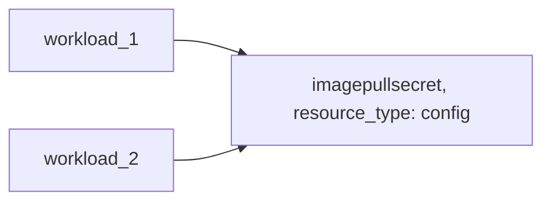

---
features:
- humanitec-operator
- imagepullsecret
--- 

# Example: config resource the configures ECR image pull secrets

## Configuration

This example configures a [config](https://developer.humanitec.com/platform-orchestrator/reference/resource-types/#config) Resource Definition, which injects an [imagePullSecret](https://kubernetes.io/docs/concepts/containers/images/#specifying-imagepullsecrets-on-a-pod) into workloads. An `imagePullSecret` is required when the k8s cluster runs outside AWS and workload use private ECR images.

The image used to fetch and periodically renew the secrets can be found here <https://github.com/humanitec-architecture/aws-ecr-credentials-refresh> and the configs are heavily inspired by <https://skryvets.com/blog/2021/03/15/kubernetes-pull-image-from-private-ecr-registry/>.

## Orchestrator setup

## Terraform docs

<!-- BEGIN_TF_DOCS -->
### Requirements

| Name | Version |
|------|---------|
| terraform | >= 1.3.0 |
| aws | ~> 5.0 |
| humanitec | ~> 1.0 |
| random | ~> 3.5 |

### Providers

| Name | Version |
|------|---------|
| aws | ~> 5.0 |
| humanitec | ~> 1.0 |

### Modules

| Name | Source | Version |
|------|--------|---------|
| imagepullsecret | ../../../humanitec-resource-defs/config/imagepullsecret | n/a |

### Resources

| Name | Type |
|------|------|
| [aws_iam_access_key.cluster_ecr_pull](https://registry.terraform.io/providers/hashicorp/aws/latest/docs/resources/iam_access_key) | resource |
| [aws_iam_user.cluster_ecr_pull](https://registry.terraform.io/providers/hashicorp/aws/latest/docs/resources/iam_user) | resource |
| [aws_iam_user_policy_attachment.cluster_ecr_pull](https://registry.terraform.io/providers/hashicorp/aws/latest/docs/resources/iam_user_policy_attachment) | resource |
| [aws_secretsmanager_secret.ecr_pull](https://registry.terraform.io/providers/hashicorp/aws/latest/docs/resources/secretsmanager_secret) | resource |
| [aws_secretsmanager_secret_version.ecr_pull](https://registry.terraform.io/providers/hashicorp/aws/latest/docs/resources/secretsmanager_secret_version) | resource |
| [humanitec_application.example](https://registry.terraform.io/providers/humanitec/humanitec/latest/docs/resources/application) | resource |
| [humanitec_resource_definition.workload](https://registry.terraform.io/providers/humanitec/humanitec/latest/docs/resources/resource_definition) | resource |
| [humanitec_resource_definition_criteria.imagepullsecret](https://registry.terraform.io/providers/humanitec/humanitec/latest/docs/resources/resource_definition_criteria) | resource |
| [humanitec_resource_definition_criteria.workload](https://registry.terraform.io/providers/humanitec/humanitec/latest/docs/resources/resource_definition_criteria) | resource |
| [aws_caller_identity.current](https://registry.terraform.io/providers/hashicorp/aws/latest/docs/data-sources/caller_identity) | data source |

### Inputs

| Name | Description | Type | Default | Required |
|------|-------------|------|---------|:--------:|
| humanitec\_secret\_store\_id | Humanitec Secret Store ID that points to AWS Secrets Manager | `string` | n/a | yes |
| region | AWS Region | `string` | n/a | yes |
| name | Name of the example application | `string` | `"hum-rp-ips-example"` | no |
| prefix | Prefix of the created resources | `string` | `"hum-rp-ips-ex-"` | no |
<!-- END_TF_DOCS -->
