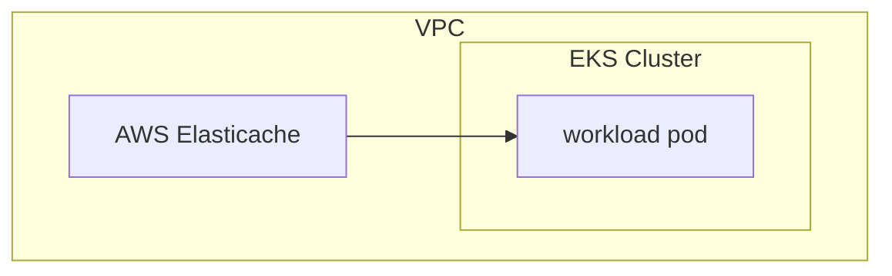
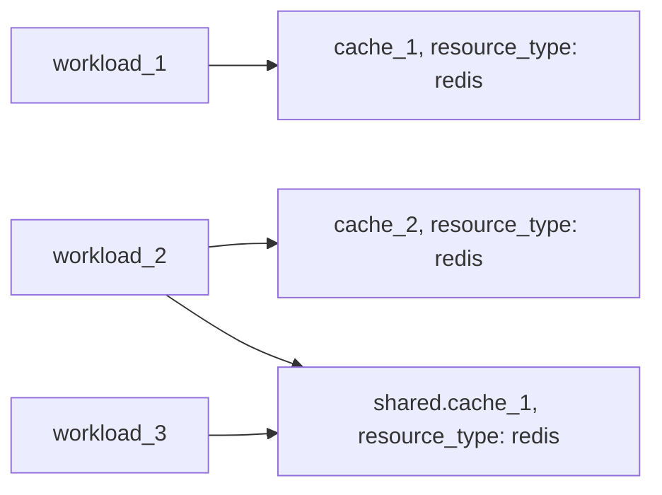

# Example: redis resource based on AWS ElastiCache

## Configuration

This example configures a [redis](https://developer.humanitec.com/platform-orchestrator/reference/resource-types/#redis) Resource Definition using AWS ElastiCache. A workload using the `redis` resource to create redis cluster looks like:

```yaml
resources:
  ...
  redis:
    type: redis
```

## Infrastructure setup



## Orchestrator setup



## Terraform docs

<!-- BEGIN_TF_DOCS -->
### Requirements

| Name | Version |
|------|---------|
| terraform | >= 1.3.0 |
| aws | ~> 5.0 |
| humanitec | ~> 1.0 |
| random | ~> 3.5 |

### Providers

| Name | Version |
|------|---------|
| aws | ~> 5.0 |
| humanitec | ~> 1.0 |
| random | ~> 3.5 |

### Modules

| Name | Source | Version |
|------|--------|---------|
| redis | ../../humanitec-resource-defs/redis/basic | n/a |

### Resources

| Name | Type |
|------|------|
| [aws_elasticache_subnet_group.redis](https://registry.terraform.io/providers/hashicorp/aws/latest/docs/resources/elasticache_subnet_group) | resource |
| [aws_iam_role.humanitec_provisioner](https://registry.terraform.io/providers/hashicorp/aws/latest/docs/resources/iam_role) | resource |
| [aws_iam_role_policy_attachment.humanitec_provisioner](https://registry.terraform.io/providers/hashicorp/aws/latest/docs/resources/iam_role_policy_attachment) | resource |
| [aws_security_group.redis](https://registry.terraform.io/providers/hashicorp/aws/latest/docs/resources/security_group) | resource |
| [aws_vpc_security_group_ingress_rule.k8s_node_redis](https://registry.terraform.io/providers/hashicorp/aws/latest/docs/resources/vpc_security_group_ingress_rule) | resource |
| [humanitec_application.example](https://registry.terraform.io/providers/humanitec/humanitec/latest/docs/resources/application) | resource |
| [humanitec_resource_account.humanitec_provisioner](https://registry.terraform.io/providers/humanitec/humanitec/latest/docs/resources/resource_account) | resource |
| [humanitec_resource_definition_criteria.redis](https://registry.terraform.io/providers/humanitec/humanitec/latest/docs/resources/resource_definition_criteria) | resource |
| [random_password.external_id](https://registry.terraform.io/providers/hashicorp/random/latest/docs/resources/password) | resource |
| [aws_iam_policy_document.instance_assume_role_policy](https://registry.terraform.io/providers/hashicorp/aws/latest/docs/data-sources/iam_policy_document) | data source |

### Inputs

| Name | Description | Type | Default | Required |
|------|-------------|------|---------|:--------:|
| k8s\_node\_security\_group\_id | AWS Security Group ID of the kubernetes nodes to allow access to the AWS ElastiCache cluster | `string` | n/a | yes |
| region | AWS Region | `string` | n/a | yes |
| subnet\_ids | AWS Subnet IDs to use for the AWS ElastiCache cluster | `set(string)` | n/a | yes |
| vpc\_id | AWS VPC ID | `string` | n/a | yes |
| name | Name of the example application | `string` | `"hum-rp-redis-example"` | no |
| prefix | Prefix of the created resources | `string` | `"hum-rp-redis-ex-"` | no |
| resource\_packs\_aws\_rev | AWS Resource Pack git branch | `string` | `"refs/heads/main"` | no |
| resource\_packs\_aws\_url | AWS Resource Pack git url | `string` | `"https://github.com/humanitec-architecture/resource-packs-aws.git"` | no |
<!-- END_TF_DOCS -->
