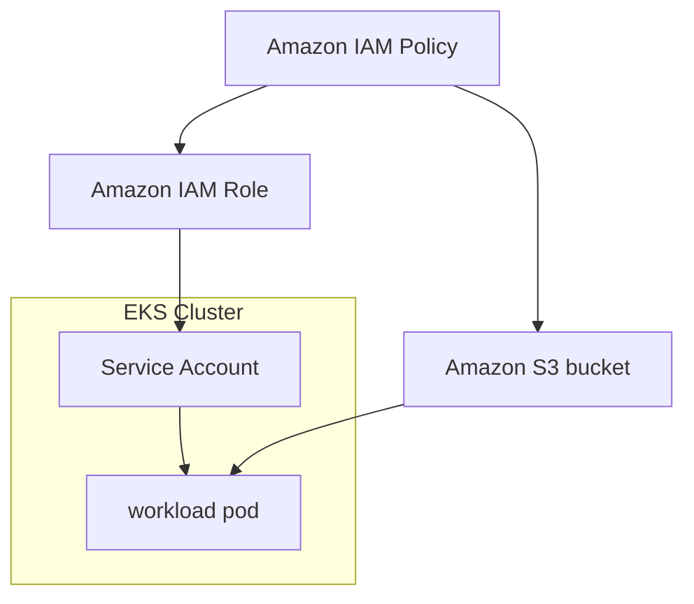
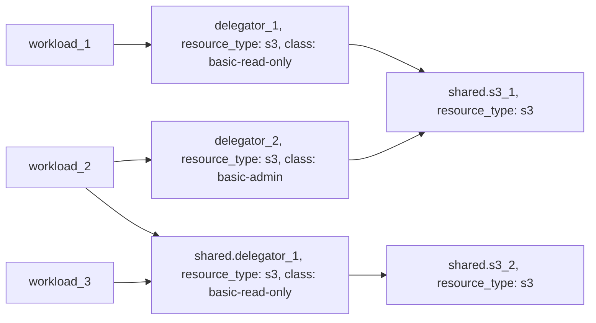

---
features:
- workload-identity
- multiple-access-classes
--- 

# Example: s3 resource based on AWS S3

## Configuration

This example configures a [s3](https://developer.humanitec.com/platform-orchestrator/reference/resource-types/#s3) Resource Definition using AWS S3, with two different access policies:

* `basic-admin` (full access)
* `basic-read-only` (read-only access)

Those Resource Definitions can be used in your Score file using:

```yaml
resources:
  ...
  s3:
    type: s3
    class: basic-admin
```

## Infrastructure setup

The workload service account will be automatically assigned to the necessary AWS IAM Role with the selected IAM Policy.



## Orchestrator setup

The Resource Graph is using [delegator resources](https://developer.humanitec.com/platform-orchestrator/examples/resource-graph-patterns/#delegator-resource) to expose shared resources with different access policies.



## Terraform docs

<!-- BEGIN_TF_DOCS -->
### Requirements

| Name | Version |
|------|---------|
| terraform | >= 1.3.0 |
| aws | ~> 5.0 |
| humanitec | ~> 1.0 |
| random | ~> 3.5 |

### Providers

| Name | Version |
|------|---------|
| aws | ~> 5.0 |
| humanitec | ~> 1.0 |
| random | ~> 3.5 |

### Modules

| Name | Source | Version |
|------|--------|---------|
| iam\_policy\_s3\_admin | ../../humanitec-resource-defs/iam-policy/s3 | n/a |
| iam\_policy\_s3\_read\_only | ../../humanitec-resource-defs/iam-policy/s3 | n/a |
| iam\_role\_service\_account | ../../humanitec-resource-defs/iam-role/service-account | n/a |
| k8s\_service\_account | ../../humanitec-resource-defs/k8s/service-account | n/a |
| s3\_basic | ../../humanitec-resource-defs/s3/basic | n/a |
| s3\_basic\_admin | ../../humanitec-resource-defs/s3/delegator | n/a |
| s3\_basic\_read\_only | ../../humanitec-resource-defs/s3/delegator | n/a |
| workload | ../../humanitec-resource-defs/workload/service-account | n/a |

### Resources

| Name | Type |
|------|------|
| [aws_iam_role.humanitec_provisioner](https://registry.terraform.io/providers/hashicorp/aws/latest/docs/resources/iam_role) | resource |
| [aws_iam_role_policy_attachment.humanitec_provisioner](https://registry.terraform.io/providers/hashicorp/aws/latest/docs/resources/iam_role_policy_attachment) | resource |
| [humanitec_application.example](https://registry.terraform.io/providers/humanitec/humanitec/latest/docs/resources/application) | resource |
| [humanitec_resource_account.humanitec_provisioner](https://registry.terraform.io/providers/humanitec/humanitec/latest/docs/resources/resource_account) | resource |
| [humanitec_resource_definition_criteria.iam_policy_s3_admin](https://registry.terraform.io/providers/humanitec/humanitec/latest/docs/resources/resource_definition_criteria) | resource |
| [humanitec_resource_definition_criteria.iam_policy_s3_read_only](https://registry.terraform.io/providers/humanitec/humanitec/latest/docs/resources/resource_definition_criteria) | resource |
| [humanitec_resource_definition_criteria.iam_role_service_account](https://registry.terraform.io/providers/humanitec/humanitec/latest/docs/resources/resource_definition_criteria) | resource |
| [humanitec_resource_definition_criteria.k8s_service_account](https://registry.terraform.io/providers/humanitec/humanitec/latest/docs/resources/resource_definition_criteria) | resource |
| [humanitec_resource_definition_criteria.s3_basic](https://registry.terraform.io/providers/humanitec/humanitec/latest/docs/resources/resource_definition_criteria) | resource |
| [humanitec_resource_definition_criteria.s3_basic_admin](https://registry.terraform.io/providers/humanitec/humanitec/latest/docs/resources/resource_definition_criteria) | resource |
| [humanitec_resource_definition_criteria.s3_basic_read_only](https://registry.terraform.io/providers/humanitec/humanitec/latest/docs/resources/resource_definition_criteria) | resource |
| [humanitec_resource_definition_criteria.workload](https://registry.terraform.io/providers/humanitec/humanitec/latest/docs/resources/resource_definition_criteria) | resource |
| [random_password.external_id](https://registry.terraform.io/providers/hashicorp/random/latest/docs/resources/password) | resource |
| [aws_iam_policy_document.instance_assume_role_policy](https://registry.terraform.io/providers/hashicorp/aws/latest/docs/data-sources/iam_policy_document) | data source |

### Inputs

| Name | Description | Type | Default | Required |
|------|-------------|------|---------|:--------:|
| cluster\_name | Name of the EKS cluster | `string` | n/a | yes |
| region | AWS Region | `string` | n/a | yes |
| name | Name of the example application | `string` | `"hum-rp-s3-example"` | no |
| prefix | Prefix of the created resources | `string` | `"hum-rp-s3-ex-"` | no |
| resource\_packs\_aws\_rev | AWS Resource Pack git branch | `string` | `"refs/heads/main"` | no |
| resource\_packs\_aws\_url | AWS Resource Pack git url | `string` | `"https://github.com/humanitec-architecture/resource-packs-aws.git"` | no |
<!-- END_TF_DOCS -->
