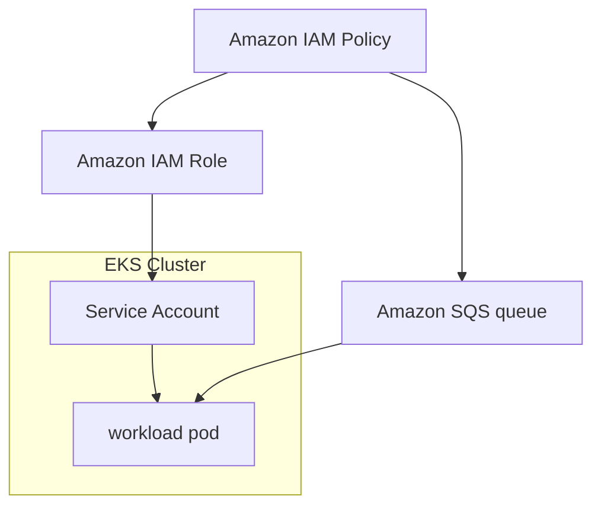
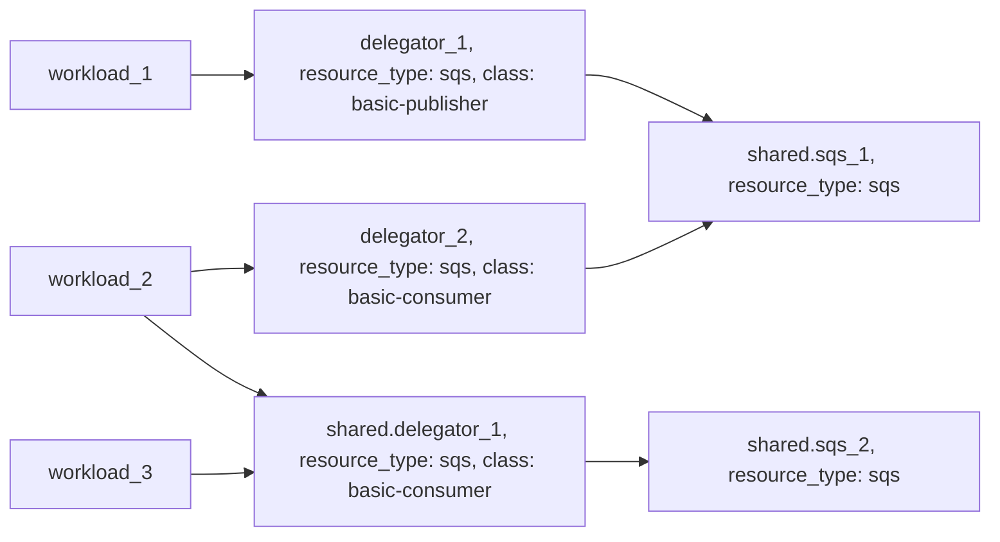

# Example: sqs resource based on AWS SQS

## Configuration
This example configures a [sqs](https://developer.humanitec.com/platform-orchestrator/reference/resource-types/#sqs) Resource Definition using AWS SQS, with two different access policies:

* `basic-publisher` (allowed to send messages)
* `basic-consumer` (allowed to receive messages)

Those Resource Definitions can be used in your Score file using:

```yaml
resources:
  ...
  queue:
    type: sqs
    class: basic-publisher
```

## Infrastructure setup
The workload service account will be automatically assigned to the necessary AWS IAM Role with the selected IAM Policy.



## Orchestrator setup
The Resource Graph is using [delegator resources](https://developer.humanitec.com/platform-orchestrator/examples/resource-graph-patterns/#delegator-resource) to expose shared resources with different access policies.



<!-- BEGIN_TF_DOCS -->
## Requirements

| Name | Version |
|------|---------|
| terraform | >= 1.3.0 |
| aws | ~> 5.0 |
| humanitec | ~> 1.0 |
| random | ~> 3.5 |

## Providers

| Name | Version |
|------|---------|
| aws | ~> 5.0 |
| humanitec | ~> 1.0 |
| random | ~> 3.5 |

## Modules

| Name | Source | Version |
|------|--------|---------|
| iam\_policy\_sqs\_consumer | ../../humanitec-resource-defs/iam-policy/sqs | n/a |
| iam\_policy\_sqs\_publisher | ../../humanitec-resource-defs/iam-policy/sqs | n/a |
| iam\_role\_service\_account | ../../humanitec-resource-defs/iam-role/service-account | n/a |
| k8s\_service\_account | ../../humanitec-resource-defs/k8s/service-account | n/a |
| sqs\_basic | ../../humanitec-resource-defs/sqs/basic | n/a |
| sqs\_basic\_consumer | ../../humanitec-resource-defs/sqs/delegator | n/a |
| sqs\_basic\_publisher | ../../humanitec-resource-defs/sqs/delegator | n/a |
| workload | ../../humanitec-resource-defs/workload/service-account | n/a |

## Resources

| Name | Type |
|------|------|
| [aws_iam_role.humanitec_provisioner](https://registry.terraform.io/providers/hashicorp/aws/latest/docs/resources/iam_role) | resource |
| [aws_iam_role_policy_attachment.humanitec_provisioner](https://registry.terraform.io/providers/hashicorp/aws/latest/docs/resources/iam_role_policy_attachment) | resource |
| [humanitec_application.example](https://registry.terraform.io/providers/humanitec/humanitec/latest/docs/resources/application) | resource |
| [humanitec_resource_account.humanitec_provisioner](https://registry.terraform.io/providers/humanitec/humanitec/latest/docs/resources/resource_account) | resource |
| [humanitec_resource_definition_criteria.iam_policy_sqs_consumer](https://registry.terraform.io/providers/humanitec/humanitec/latest/docs/resources/resource_definition_criteria) | resource |
| [humanitec_resource_definition_criteria.iam_policy_sqs_publisher](https://registry.terraform.io/providers/humanitec/humanitec/latest/docs/resources/resource_definition_criteria) | resource |
| [humanitec_resource_definition_criteria.iam_role_service_account](https://registry.terraform.io/providers/humanitec/humanitec/latest/docs/resources/resource_definition_criteria) | resource |
| [humanitec_resource_definition_criteria.k8s_service_account](https://registry.terraform.io/providers/humanitec/humanitec/latest/docs/resources/resource_definition_criteria) | resource |
| [humanitec_resource_definition_criteria.sqs_basic](https://registry.terraform.io/providers/humanitec/humanitec/latest/docs/resources/resource_definition_criteria) | resource |
| [humanitec_resource_definition_criteria.sqs_basic_consumer](https://registry.terraform.io/providers/humanitec/humanitec/latest/docs/resources/resource_definition_criteria) | resource |
| [humanitec_resource_definition_criteria.sqs_basic_publisher](https://registry.terraform.io/providers/humanitec/humanitec/latest/docs/resources/resource_definition_criteria) | resource |
| [humanitec_resource_definition_criteria.workload](https://registry.terraform.io/providers/humanitec/humanitec/latest/docs/resources/resource_definition_criteria) | resource |
| [random_password.external_id](https://registry.terraform.io/providers/hashicorp/random/latest/docs/resources/password) | resource |
| [aws_iam_policy_document.instance_assume_role_policy](https://registry.terraform.io/providers/hashicorp/aws/latest/docs/data-sources/iam_policy_document) | data source |

## Inputs

| Name | Description | Type | Default | Required |
|------|-------------|------|---------|:--------:|
| cluster\_name | Name of the EKS cluster | `string` | n/a | yes |
| region | AWS Region | `string` | n/a | yes |
| name | Name of the example application | `string` | `"hum-rp-sqs-example"` | no |
| prefix | Prefix of the created resources | `string` | `"hum-rp-sqs-ex-"` | no |
| resource\_packs\_aws\_rev | AWS Resource Pack git branch | `string` | `"refs/heads/main"` | no |
| resource\_packs\_aws\_url | AWS Resource Pack git url | `string` | `"https://github.com/humanitec-architecture/resource-packs-aws.git"` | no |
<!-- END_TF_DOCS -->
